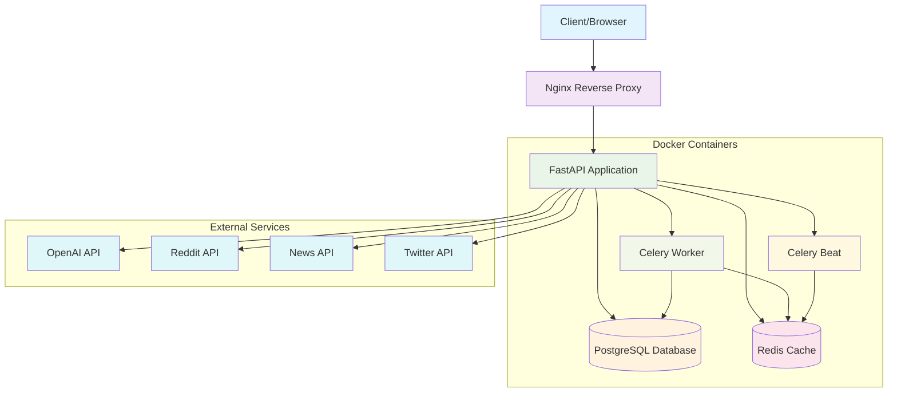
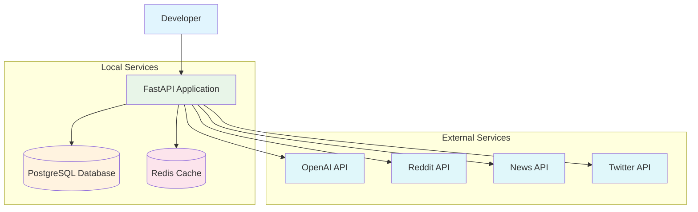
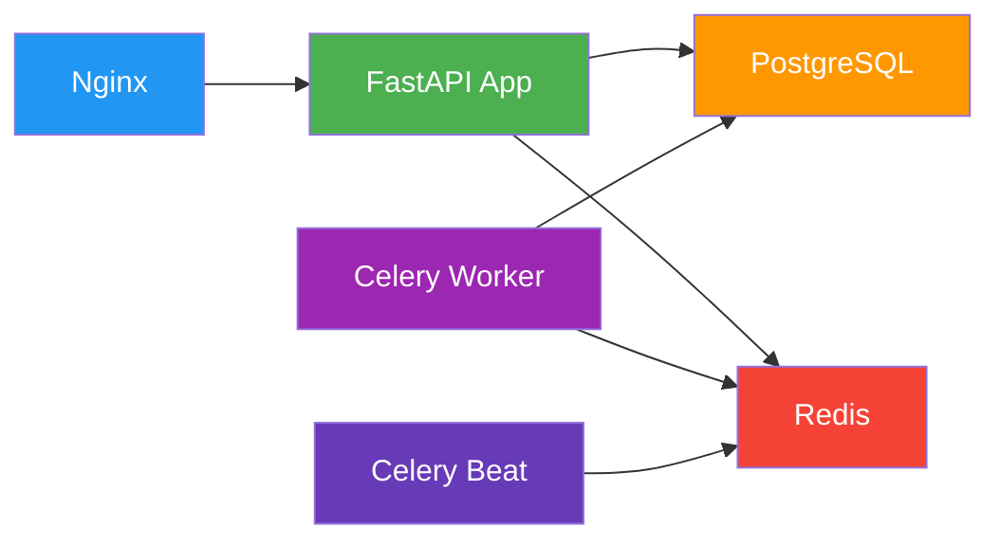
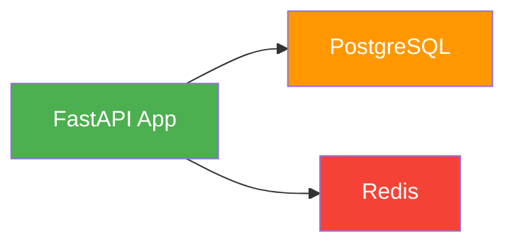
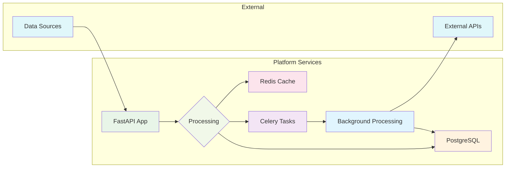
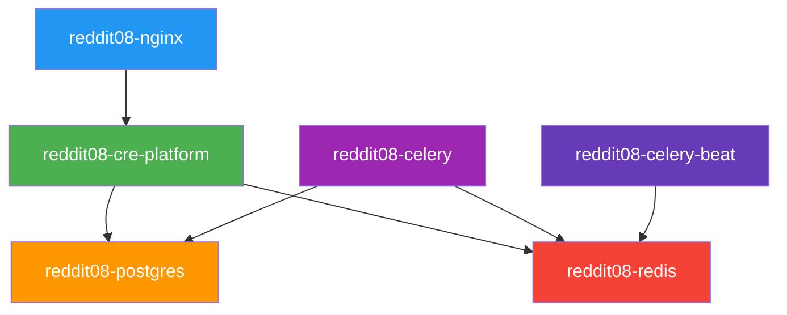
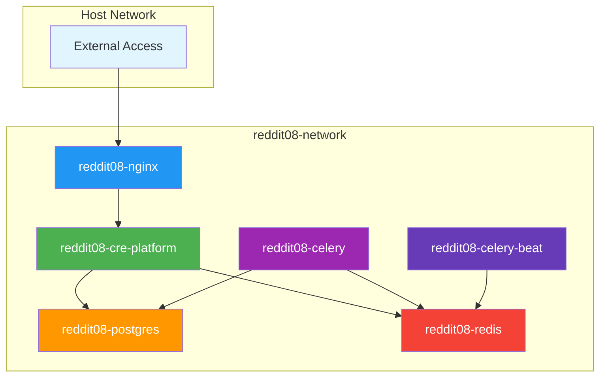

# CRE Intelligence Platform Deployment Architecture

## Overview

This document provides visual diagrams illustrating the architecture of both Docker deployment and local development setup options for the CRE Intelligence Platform.

## Docker Deployment Architecture

## Local Development Architecture

## Service Dependencies

### Docker Deployment Dependencies

### Local Development Dependencies

## Data Flow Diagram

### Docker Deployment Data Flow

## Container/Process Relationships

### Docker Container Relationships

## Network Architecture

### Docker Network Isolation

## Key Differences Summary

| Aspect | Docker Deployment | Local Development |
|--------|------------------|-------------------|
| **Isolation** | Full container isolation | Direct system access |
| **Dependencies** | All in containers | Requires local services |
| **Management** | Docker Compose commands | Manual service management |
| **Scalability** | Easy horizontal scaling | Limited scaling |
| **Consistency** | Guaranteed environment consistency | Depends on local setup |
| **Resource Usage** | Higher (container overhead) | Lower (direct access) |
| **Debugging** | Container-based debugging | Direct system debugging |

## Deployment Recommendations

### For Production Use
- ✅ Use Docker deployment
- ✅ Ensure proper resource allocation
- ✅ Configure monitoring and logging
- ✅ Set up backup procedures
- ✅ Implement security best practices

### For Development Use
- ✅ Use local development setup
- ✅ Enable debug mode
- ✅ Use development-focused configurations
- ✅ Set up hot-reloading
- ✅ Configure detailed logging

## Support Resources

- Full Documentation: [docs/README.md](./docs/README.md)
- Installation Guide: [INSTALLATION_GUIDE.md](./INSTALLATION_GUIDE.md)
- Deployment Summary: [DEPLOYMENT_SUMMARY.md](./DEPLOYMENT_SUMMARY.md)