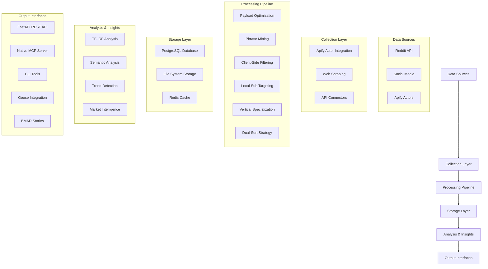
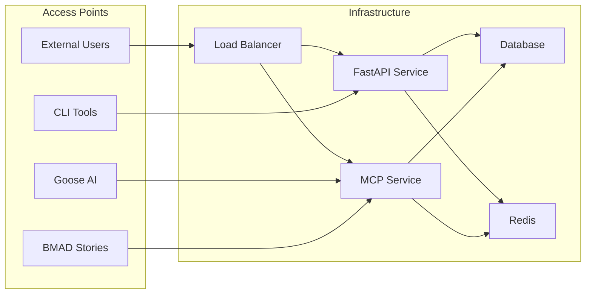

# CRE Intelligence Platform - Architecture Summary

## Overview

The CRE Intelligence Platform is a sophisticated Commercial Real Estate (CRE) intelligence gathering and analysis system that collects data from Reddit and social media sources, processes it through six specialized techniques, and provides actionable insights for CRE professionals.

## System Architecture

## Core Components

### 1. Six Intelligence Techniques

#### Technique 1: Iterative JSON Refinement (Payload Optimization)
- Optimizes Apify Actor payloads for efficient data collection
- Compresses boolean clauses to stay within URL length limits
- Removes redundant search terms
- Expands coverage for missing areas
- Generates subreddit-specific start URLs
- **Status: ✅ Implemented**

#### Technique 2: TF-IDF Phrase Mining
- Extracts domain-specific terminology using TF-IDF analysis
- Classifies terms into financial, legal, operational, market, and development categories
- Identifies emerging terms compared to previous periods
- Maintains lexicon of specialized CRE terminology
- **Status: ✅ Implemented**

#### Technique 3: Client-Side Filtering Pipeline
- 6-stage filtering process:
  1. Temporal filtering (date range)
  2. Keyword filtering (inclusion/exclusion)
  3. Quality filtering (length, score thresholds)
  4. Semantic similarity filtering
  5. Geographic filtering
  6. Deduplication
- Calculates composite relevance scores for posts
- **Status: ✅ Implemented**

#### Technique 4: Local-Sub Geographic Targeting
- Targets and expands local subreddit coverage
- Discovers related subreddits for metro areas
- Analyzes posting patterns for different regions
- Maintains metro-specific configurations
- **Status: ✅ Implemented**

#### Technique 5: Vertical/Niche Specialization
- Specializes targeting for CRE verticals (office, retail, industrial, etc.)
- Maintains vertical-specific lexicons
- Resolves conflicts between vertical terms
- Generates vertical-specific search strategies
- **Status: ✅ Implemented**

#### Technique 6: Dual-Sort Strategy
- Executes dual-sort approach for comprehensive coverage
- Implements deduplication across sort strategies
- Analyzes temporal coverage gaps
- Executes backfill for historical data
- **Status: ✅ Implemented**

### 2. API Layer

#### FastAPI Server
- Provides RESTful endpoints for all six techniques
- Implements comprehensive data models and validation
- Offers interactive API documentation via Swagger UI
- Supports full pipeline execution
- **Status: ✅ Implemented**

#### Native MCP Server
- Implements Model Context Protocol for AI agent integration
- Provides WebSocket-based communication
- Exposes the same tools as the FastAPI server
- Supports tool listing and execution
- **Status: ✅ Implemented**

### 3. Data Management

#### Storage Components
- **PostgreSQL Database**: Stores posts and keyword data (migrated from SQLite)
- **File System**: Raw, processed, and lexicon data in JSON/JSONL format
- **Redis Cache**: For performance optimization
- **Status: ✅ Implemented**

#### Data Flow
1. Raw data collection from Reddit/social media
2. Processing through the six techniques
3. Storage of intermediate and final results
4. Analysis and insight generation
5. Export for external consumption
- **Status: ✅ Implemented**

### 4. Development Infrastructure

#### Testing
- Comprehensive test suite with unit and integration tests
- Pytest-based testing framework
- Continuous integration with GitHub Actions
- Code coverage reporting
- **Status: ✅ Implemented**

#### Quality Assurance
- Pre-commit hooks for code formatting (Black, isort)
- Linting with Flake8
- Type checking with MyPy
- Security scanning with Bandit
- **Status: ✅ Implemented**

#### Deployment
- Docker containerization support
- Makefile for common development tasks
- CI/CD pipeline with GitHub Actions
- Environment configuration management
- **Status: ✅ Implemented**

## Key Technologies

- **Python 3.9+**: Primary programming language
- **FastAPI**: REST API framework
- **WebSockets**: Real-time communication for MCP server
- **Pandas/NumPy**: Data processing and analysis
- **Scikit-learn**: Machine learning and TF-IDF analysis
- **PostgreSQL**: Primary database (migrated from SQLite)
- **Redis**: Caching layer
- **Docker**: Containerization
- **GitHub Actions**: CI/CD pipeline
- **Goose AI**: Interactive workflow orchestration
- **BMAD**: Structured task management

## Integration Points

### External Integrations
- Reddit API for data collection
- Apify Actors for web scraping
- Goose AI for interactive workflows
- BMAD for structured task management

### Internal Components
- FastAPI server for REST access
- Native MCP server for AI agent integration
- CLI tools for automation
- Utility scripts for data management

## Deployment Architecture

## Data Flow Architecture

```mermaid
graph LR
    A[Data Sources] --> B[Collection]
    B --> C[Technique 1: Payload Optimization]
    C --> D[Technique 2: Phrase Mining]
    D --> E[Technique 3: Client-Side Filtering]
    E --> F[Technique 4: Local-Sub Targeting]
    F --> G[Technique 5: Vertical Specialization]
    G --> H[Technique 6: Dual-Sort Strategy]
    H --> I[Storage]
    I --> J[Analysis]
    J --> K[Output Interfaces]
```

## Scalability Considerations

1. **Horizontal Scaling**: FastAPI services can be scaled horizontally
2. **Caching**: Redis cache layer for performance optimization
3. **Asynchronous Processing**: Async/await patterns throughout
4. **Batch Processing**: Data processing in batches for efficiency
5. **Database Optimization**: PostgreSQL with proper indexing

## Security Considerations

1. **Environment Configuration**: Secure handling of API keys
2. **Input Validation**: Pydantic models for data validation
3. **Dependency Management**: Regular security scanning
4. **Code Quality**: Static analysis and linting
5. **Access Control**: API key authentication and rate limiting

## Monitoring and Observability

1. **Logging**: Structured logging throughout the application
2. **Performance Monitoring**: Built-in performance monitoring tools
3. **Health Checks**: API endpoints for service health
4. **Metrics Collection**: System and API performance metrics
5. **Error Tracking**: Exception handling and reporting

## Current Implementation Status

### Completed Features ✅
- All six intelligence techniques fully implemented
- FastAPI REST API with comprehensive endpoints
- Native MCP server for AI agent integration
- PostgreSQL database migration
- Redis caching layer
- Comprehensive CLI tools for automation
- Docker containerization
- CI/CD pipeline with GitHub Actions
- Goose AI integration with session templates
- BMAD stories for structured workflows
- Automated scheduling with MCP Use

### In Progress Features ⏳
- Advanced analytics and ML model integration
- Web-based dashboard for monitoring
- Enhanced security features (OAuth2, role-based access)
- Multi-tenant architecture support

This architecture provides a solid foundation for a CRE intelligence platform that can be extended and scaled as needed.